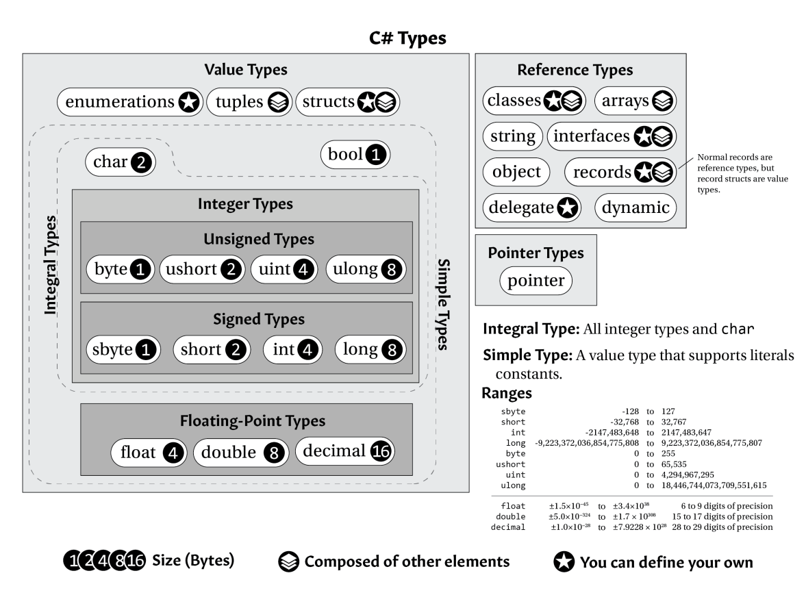

# Readme 

## Part 2 

### L6 C# Types
Prop types
Name|Bytes|Allow Negatives|Minimum|Maximum
---|---|---|---|---
byte|1|No|0|255
short|2|Yes|-32,768|32,767
int|4|Yes|-2,147,483,648|2,147,483,647
long|8|Yes|-9,223,372,036,854,775,808|9,223,372,036,854,775,807
sbyte|1|Yes|-128|127
ushort|2|No|0|65,535
uint|4|No|0|4,294,967,295
ulong|8|No|0|18,446,744,073,709,551,615

THE CONVERT CLASS AND THE PARSE METHODS
Method Name|Target Type|Method Name|Target Type
---|---|---|---
ToByte|byte|ToSByte|sbyte
ToInt16|short|ToUInt16|ushort
ToInt32|int|ToUInt32|uint
ToInt64|long|ToUInt64|ulong
ToChar|char|ToString|string
ToSingle|float|ToDouble|double
ToDecimal|decimal|ToBoolean|bool



### L10 Switch
```c#
string response;
response = choice switch
{
1 => "Ye rest and recover your health.",
2 => "Raiding the port town get ye 50 gold doubloons.",
3 => "The wind is at your back; the open horizon ahead.",
4 => "'Tis but a baby Kraken, but still eats toy boats.",
_ => "Apologies. I do not know that one."
};
Console.WriteLine(response);
```


### L22 NULL REFERENCES 

Null-Conditional Operators: ?. and ?[]
There is another way: null-conditional operators. The ?. and ?[] operators can be used in
place of . and [] to simultaneously check for null and access the member:

```c#
private string? GetTopPlayerName()
{
return _scoreManager?.GetScores()?[0]?.Name;
}
```

The Null Coalescing Operator: ??
The null coalescing operator (??) is also a useful tool. It takes an expression that might be null
and provide a value or expression to use as a fallback if it is:
```c#
private string GetTopPlayerName() // No longer needs to allow nulls.
{
return _scoreManager?.GetScores()?[0]?.Name ?? "(not found)";
}
```

The Null-Forgiving Operator: !
```c#
string message = MightReturnNullIfNegative(+10)!;
```

### L23 DESIGNING THE SOFTWARE
UML
CRC Cards
